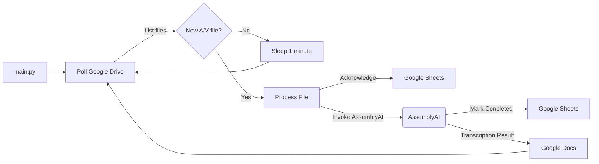

# Scriblime - Audio Transcription Service

This project is an audio transcription service that connects to [Google Drive](https://drive.google.com/drive/home), transcribes audio files using the [AssemblyAI](https://www.assemblyai.com/) transcription API, and stores the transcription results in Google Docs and Google Sheets.

## Features

- Monitors a specified Google Drive folder for new audio/video files.
- Utilizes AssemblyAI's transcription API for converting audio to text.
- Creates a Google Doc in the same folder with the transcription results.
- Maintains a Google Sheets spreadsheet to track the status of audio files.

## Architecture Overview

The architecture of the audio transcription service involves monitoring a Google Drive folder for new audio or video files. Upon detection of a compatible file, the service acknowledges it in a Google Sheets document and invokes AssemblyAI for transcription. Once the transcription is complete, the service updates the Google Sheets document with the transcription status.



## Usage

1. Clone the repository.
   ```bash
   git clone https://github.com/joshknopp/scriblime.git
   ```

1. **Set up Google APIs:**
   - Create a project in the [Google API Console](https://console.cloud.google.com/projectcreate).
   - Enable the [Google Drive API](https://console.cloud.google.com/apis/api/drive.googleapis.com/credentials) and create OAuth 2.0 credentials.
   - Download the credentials JSON file and save as [`config/credentials.json`](./config/credentials.json).
   - Enable the [Google Sheets](https://console.cloud.google.com/apis/api/sheets.googleapis.com) and [Google Docs](https://console.cloud.google.com/apis/api/docs.googleapis.com) APIs. [test]

1. **Set up AssemblyAI:**
   - Visit [AssemblyAI home](https://www.assemblyai.com/app/) and set up an account if necessary.
   - Use the `Copy API key` button and paste key into a file called [`config/assemblyai.key`](./config/assemblyai.key).
      - There should be no other content in this file, just the API key on a single line.

1. Install dependencies.
   ```bash
   pip install -r requirements.txt
   ```

1. Modify any global variables as needed. Defaults should generally be fine, but update `FOLDER_NAME = 'scriblime'` if necessary to target a different folder in Google Drive.

1. Run the service.
   ```bash
   python main.py
   ```

1. On first run, monitor the console and click or copy-paste the Google API Console authentication link that appears there.
   - `InstalledAppFlow` launches a temporary web server on port 5001 to handle authentication flow.
   - Google will prompt you to grant access to Drive, Sheets, and Docs APIs.
   - The temporary server will shut down on successful authentication.

## Contributing

Contributions are welcome! Please feel free to submit issues and pull requests.

## License

This project is licensed under the MIT License.

## Credit

Header image created with [Ideogram.ai](https://ideogram.ai/).