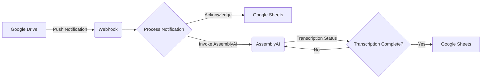

# Audio Transcription Service

This project is an audio transcription service that connects to Google Drive, transcribes audio files using the AssemblyAI transcription API, and stores the transcription results in Google Docs and Google Sheets.

## Features

- Monitors a specified Google Drive folder for new audio files.
- Utilizes AssemblyAI's transcription API for converting audio files to text.
- Creates a Google Doc in the same folder with the transcription results.
- Maintains a Google Sheets spreadsheet to track the status of audio files.

## Architecture Overview

The architecture of the audio transcription service involves monitoring a Google Drive folder for new audio files. Upon detection of a new audio file, the service acknowledges it in a Google Sheets document and invokes AssemblyAI for transcription. Once the transcription is complete, the service updates the Google Sheets document with the transcription status.

- [ ] TODO: Update architecture visualization to reflect polling instead of push/webhook



## Implementation Steps

1. **Set up Google Drive API:**
   - Create a project in the Google API Console.
   - Enable the Google Drive API and create OAuth 2.0 credentials.
   - Download the credentials JSON file and place it in the project directory.

2. **Install Required Libraries:**
   - Install the Google Client Library for Python.

3. **Set up Authentication:**
   - Implement authentication using OAuth 2.0 credentials and store tokens in `token.json`.

4. **Implement Push Notifications:**
   - Set up push notifications for changes in the specified Google Drive folder.
   - Handle notifications using a webhook.

5. **Handle Notifications and Update Google Sheets:**
   - Process notifications to acknowledge new audio files in Google Sheets.
   - Invoke AssemblyAI for transcription and update Google Sheets with the transcription status.

## Usage

1. Clone the repository.
```bash
git clone https://github.com/yourusername/your-repository.git
```

2. Install dependencies.
```bash
pip install -r requirements.txt
```

3. Run the service.
```bash
python main.py
```

## Configuration

- Replace placeholders such as `path/to/your/credentials.json`, `your_spreadsheet_id`, etc., with your actual values.
- Ensure proper permissions are set for the Google Drive folder and the Google Sheets document.

## Contributing

Contributions are welcome! Please feel free to submit issues and pull requests.

## License

This project is licensed under the MIT License.
